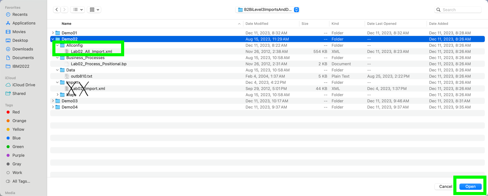
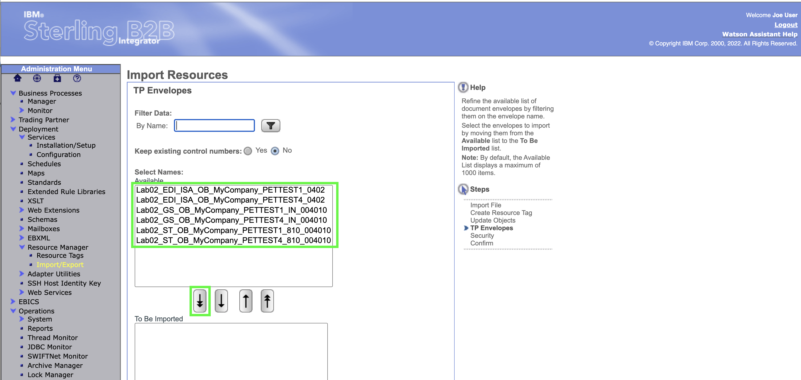
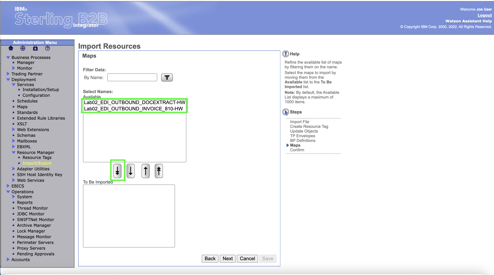
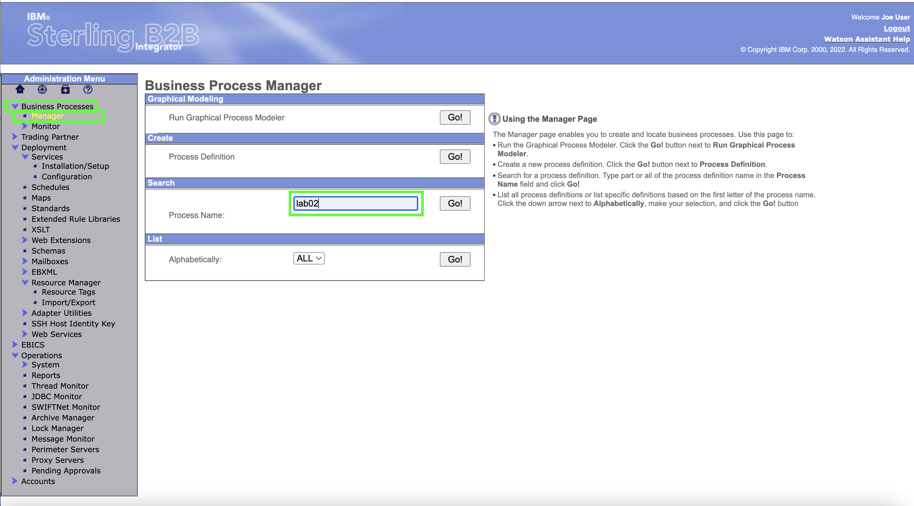
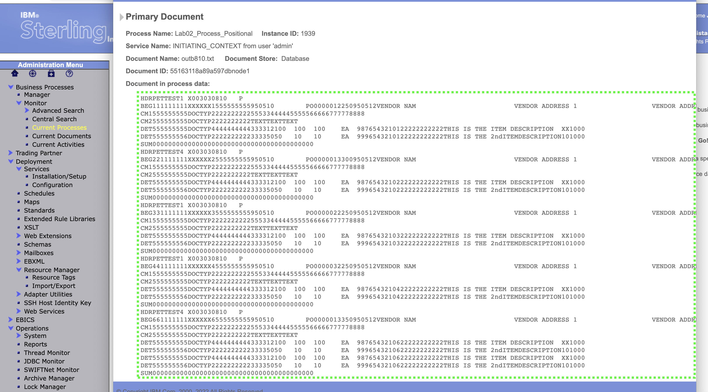
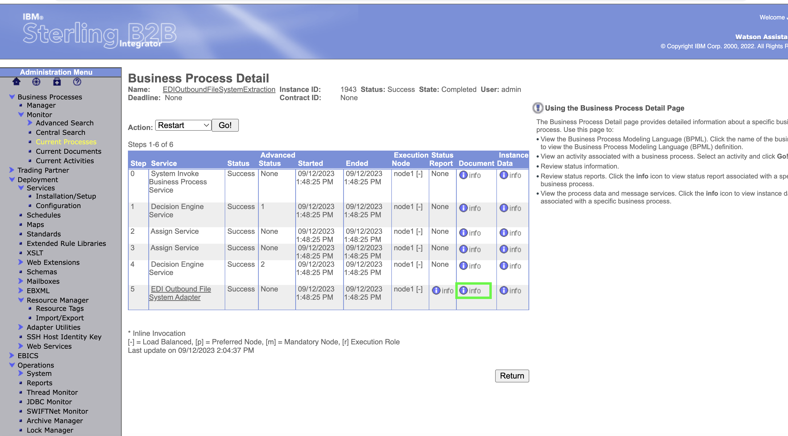

Example 2 simulates an application file containing multiple invoices in a proprietary format and splits it into two or three EDI ANSI X12 810 documents.   This chapter contains both the B2Bi Configuration import steps and the client demo steps (Demo 1 is split into 2 chapters). The import steps would likely not be part of a client demonstration.   The business process, maps, and envelopes are imported into B2B integrator.  

Before proceeding, take 2 minutes to listen to an explanation of the setup and demo. 

## Open the B2Bi dashboard and import the lab02 definition

1. In the B2B Integrator web console, click **Import/Export** under the **Resource Manager** under **Deployment** in the left-hand panel.

2. Click **Choose File** in the **Import Resources** page.

3. Select the **Lab02_All_Import.xml** in the **Demo2/AllConfig** sub folder of the B2BiLevel3ImportsAndData directory you downloaded  earlier. Based on historic purposes, the Import in the "Imports" folder for Demo 2 is only partial.    

!!! Note
    If you have not downloaded the B2BiLevel3ImportsAndData zip file and expanded, see the explanation in the Optional: Shortcut Method section of Demo 1 Setup chapter.  

4. Enter **password** into the Passphrase dialog box and click **Next**

5. No changes to Resource Tags so click **Next** 

6. Leave the default to allow updates if objects exist in the system.   Click **Next**

7. Use the **double down arrow** to select all of the TP (Trading Partner) Envelopes

In the latest {{offering.name}} release, new password policies have been set that require users to change their password the first time they authenticate. 

8. The trading partner envelopes are shown as all selected. Click **Next** 

9. Use the **double down arrow** to select all of the BP (Business Process) Definitions.  Then click **Next**

10. Use the **double down arrow** to select all of the Maps.  
   

11.  The maps are shown as all selected to be imported.  Click **Next**
    

12.   All of the artifacts selected for import are shown.   If any are missing, hit the **Back** button and make the additional selections.    Otherwise, click **Finish**

13.   Click **Return** 

!!! important "Important"

    That is the end of the setup necessary for the lab.   In a customer demo situation, that should usually get setup ahead of time so that only the following steps are needed to show the demo scenario itself.

## Execute the lab02 demo

1.  Click **Business Processes** and then **Manager**. In the Search box enter **lab02** to search for the process name. 

??? question "BP quiz question"
    Not sure what question best here ir even if the popp up is functioning.

2. Click on the **Execution Manager** 

3.  Click **Execute** to run the business process. 

4.  In the **Local Desktop filename** Select **Choose File**  
   

5.  On the desktop itself choose the input file **outb810.txt** from the file system.  
 
!!! Note "Note"

    Generally, documents sent by the B2B Integrator host company to trading partners are considered "outbound" and ANSI X12 invoices are "810"s, hence the outb810 name.  This contents and formatting of this file is critical for the proper functioning of the business process.  The file format is typical of many flat file formatted application files.  The file is processed by two different maps in the Business Process.   The first finds the partner name off an internal supplier number in the application file.   The second translates the contents of the file into into an ANSI X12 EDI format.  is the end of the setup necessary for the lab.   In a customer demo situation, that should usually get setup ahead of time so that only the following steps are needed to show the demo scenario itself.

6.   Once the file is shown as selected next to **Choose File** click **GO!**

7.  Wait until the Business Process completes and all of the Status are shown as **Success** Click **Close** in the upper right of the screen.

## View the Business Process Results

Now that the Business Process has run, the user can view detail of the process.  

8.   Click **Current Processes** under **Monitor** which is under **Business Process**

9. Click the **ID** next to the **Lab02_Process_Positional** step
    

10.   Inside the  **Lab02_Process_Positional** click on **info** in the first line under the **Document** column

11.  The Input application file is shown.  This is the format coming out of an Accounts Receivable module most likely in an ERP system.  Close out of this screen.

12.  Click on the top process in the **Id** Column.

13.  View the final output document by clicking on **info** in the last row under the **Document** column. 

14.   The output ANSI X12 document is shown.   

??? question "BP quiz question"
    There is a quiz question on the BP quiz from the results of the EDI file above

This concludes Demo 2. 

