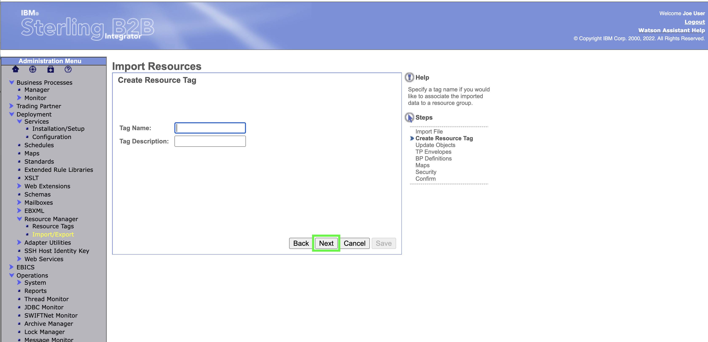
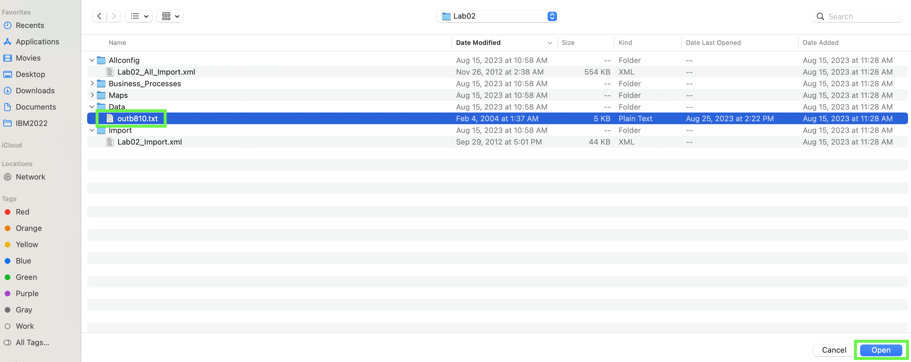

Lab2 takes an application file with two invoices in a proprietary format and splits it into two or three EDI ANSI X12 810 documents.   There is a short import scenario that does not have to be part of the demonstration.   The business process, maps, and envelopes are imported into B2B integrator.  

## Open the B2Bi dashboard and import the lab02 definition

1. In the B2B Integrator web console, click **Routes** under the **Networking** section in left-hand panel.

2. Select Import XML   Click the **All Projects** pull-down menu and click the **b2bi** project.

??? question "BP quiz question"
    Several BP quiz questions will come from the **OpenShift web console**. When taking the BP quiz make sure the ITZ environment is still active and keep this demonstration script open.

3. Notice all the routes that are currently defined in the b2bi Project, there are 15 of them

4. To start the setup of the SFTP adapter, launch the IBM Sterling B2Bi dashboard by clicking on the route for the **sterling-fg-b2bi-asi-internal-route-dashboard** route in the **Location** column. Do not click the Route name, rather click the Route link in the **Location** column of the table.

1. If a security risk is received in the browser, accept it. In a production environment certificates would be configured for these web pages.

Hello there....

Note: the images above are from Firefox running on MacOS. They will look different depending on browser and operating system.

!!! hint
    As this is a new install, in this demonstration the default user ids and passwords will be used. To keep things simple in this demonstration, all passwords will be set to **password**. Not secure, but this will be a short lived demonstration environment.

1. Enter **admin** in the **User ID** field and **password** in the **Password** field, and then click **Sign In**.

In the latest {{offering.name}} release, new password policies have been set that require users to change their password the first time they authenticate. 

1. Enter **password** in the **Old Password** field, and then enter **passw0rd!** in both the **New Password** and **Retype Password** fields and click **Sign In**. 

For this demonstration environment, change the password policies to simplify the demonstration flow. 

8. Click **Accounts** in left-hand menu and then click **Password Policy**.

9. Enter **default** in the **Password Policy Name** text entry field and click the **Go!** button in the **Search** section.

10. Click the **edit** icon for the **Default User Policy**.

1.  Uncheck the **Password required to contain special characters** and **Required password change on next login attempt** check boxes and then click **Save**.

1.  Click **Finish** on the confirmation screen.

!!! important "Important"

    In most cases, clients will typically strengthen the default password policy to match their corporate standards for passwords. Again, they are being reduced here to simplify the demonstration flow.

13. Click **Return** on the completion screen.

## Create a SSH Host Identity key

First, a **SSH Host Identity** needs to be created. The Host Identity Key is a Private/Public key pair used to identify the Application SFTP Server to remote clients.  Note, for this demonstration, default values will be used where possible, but production deployments may use other values depending on client requirements.

??? question "BP quiz question"
    Several BP quiz questions will come from the **B2Bi dashboard**. When taking the BP quiz make sure the ITZ environment is still active and keep this demonstration script open.

14. Click the **Deployment** menu item in left-hand menu bar and then click the **SSH Host Identity Key** option.

15. Click the **Go!** button in the **Create: New Host Identity Key** box.

16. Enter **demo** in the **Host Name:** field of the "New Host Identity Key" form and then click the **Next** button.

17. Click **Finish**.

1.  Click **Close** on the pop-up dialog.

1.  Wait until the completed message is received and the click the **Return** button.

## Create an SFTP adapter

Next, an SFTP adapter must be created which will utilize the OpenShift service port for B2Bi.

20. Click the **Services** menu item under **Deployment** in the left-hand menu bar.

21. Click the **Configuration** menu item under **Services**.

22. Enter **sftp** in the **Service Name** field and click the **Go!** button in the **Search** box.

23. Locate the **SFTP Server Adapter** entry in the table and click the **edit** button.

24. Review the default settings and click **Next**.

25. Review the settings on the **SFTP Server Adapter: Configuration** form.

The default **SFTP Server Listen Port** must be changed to the B2Bi service port configured in OpenShift.

26. Switch back to the OpenShift web console browser window or tab and click **Services** under the **Networking** in the left-hand menu bar.

??? question "BP quiz question"
    There is a quiz question related to other B2Bi services. You may want to take note of the other service names or take a screen capture.

27. Find and click the **sterling-fg-b2bi-asi-backend-svc** link.

28. Locate and copy the **Node Port** number for **adapters-1** in the **Service port mapping** table.

29. Record the **Node Port** number, it will be used several times during this demonstration.

30. Switch back to the **B2Bi Dashboard** browser window or tab.

??? question "BP quiz question"
    There is a quiz question related to configuring the SFTP adapter. Before clicking **Next** in the following step, look at the alternate **Compression** type available for the SFTP adapter. You may want to record that value.

31. Blah di blab **Bold Blah** More blah  
    
