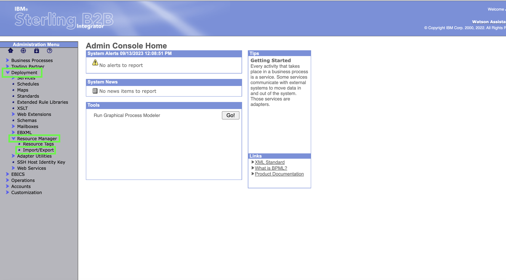
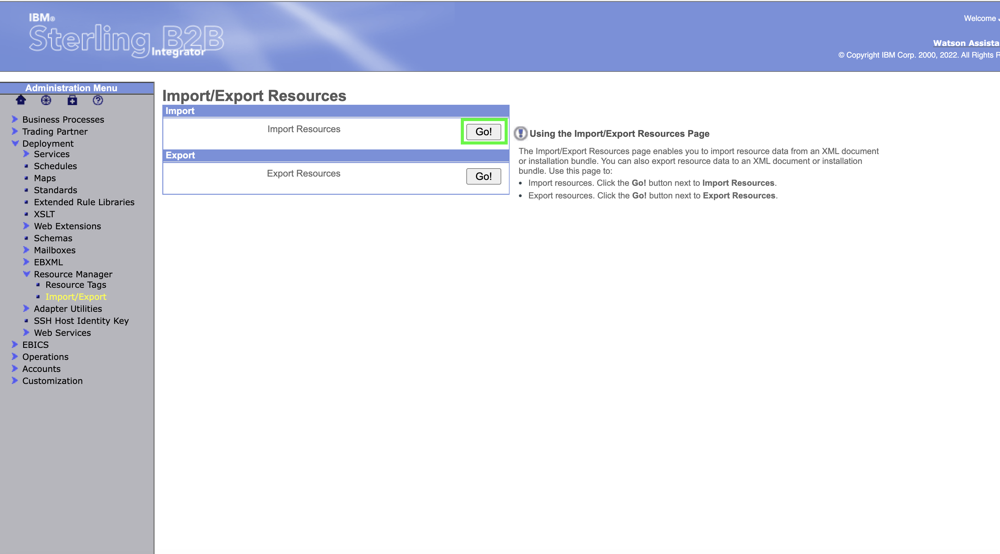
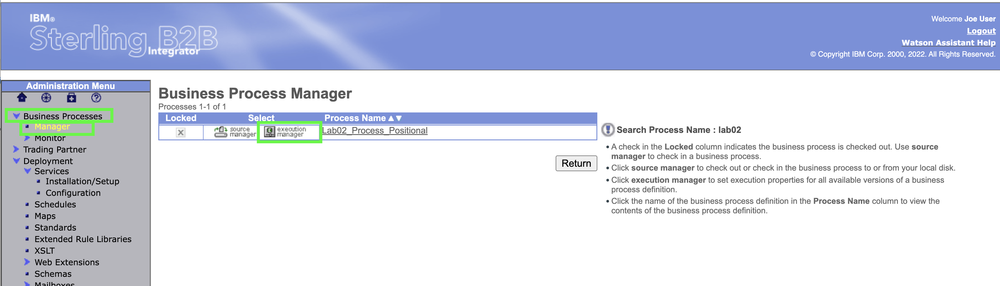
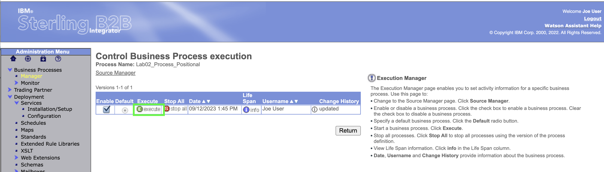
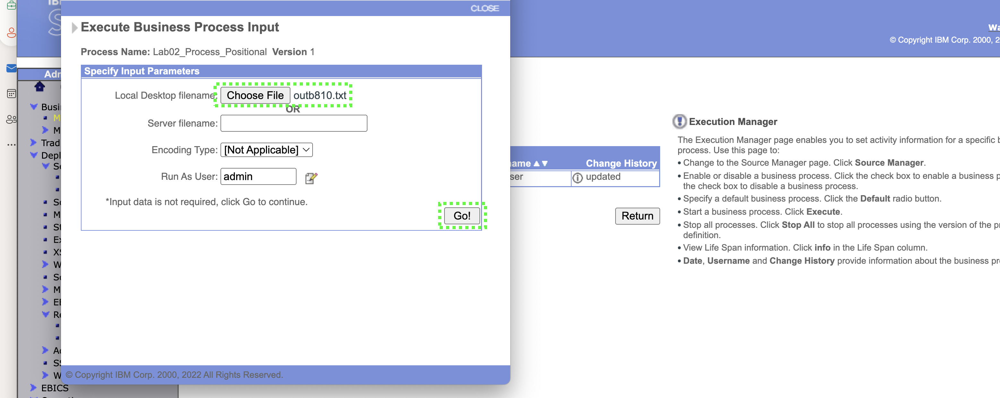
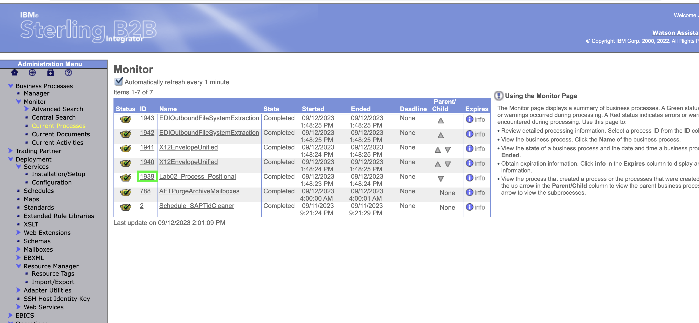

Lab3 simulates an EDIFACT EDI interchange being received by B2B Integrator and processed into an application file.

The import does not have to be part of the demonstration.   The business process, maps,  envelopes etc. are imported into B2B integrator.  

## Open the B2Bi dashboard and import the lab03 definition

1. In the B2B Integrator web console, click **Import/Export** under the **Resource Manager** under **Deployment** in the left-hand panel.

1. Click **GO** 
   

??? question "BP quiz question"
    Several BP quiz questions will come from this area **B2Bi Import**. When taking the BP quiz make sure tyou have noted the number of maps imported.

1. Click **Choose File** in the **Import Resources** page.

4. Select the **Lab03_Import.xml**  This may look different depending upon what platform you are importing the xml from.

5. Enter **password** into the Passphrase dialog box and click **Next**

1. No changes to Resource Tags so click **Next** 

5. Leave the default to allow updates if objects exist in the system.   Click **Next**

!!! hint
    Note sure what to hint about here....if anything.....

1. Use the **double down arrow** to select all of the TP (Trading Partner) Envelopes

In the latest {{offering.name}} release, new password policies have been set that require users to change their password the first time they authenticate. 

7. The trading partner envelopes are shown as all selected. Click **Next** 

1. Use the **double down arrow** to select all of the Maps.  Then click **Next**

1. Use the **double down arrow** to select all of the Users.  Then click **Next**

1. Use the **double down arrow** to select all of the Permissions.  Then click **Next**

1. Use the **double down arrow** to select all of the Mailbox Virtual Root.  Then click **Next**

1. Leave the default of **Select All**  Then click **Next**

1. Use the **double down arrow** to select all of the Mailbox Routing Rules.  
   

!!! important "Important"

    That is the end of the setup necessary for the lab.   In a customer demo situation, that should usually get setup ahead of time so that only the following steps are needed to show the demo scenario itself.

## Execute the lab03 demo ---  NEED TO UPDATE WITH JAMES

13.  Click **Business Processes** and then **Manager**. In the Search box enter **lab02** to search for the process name. 

??? question "BP quiz question"
    Not sure what question best here ir even if the popp up is functioning.

14. Click on the **Execution Manager** 

15.  Click **Execute** to run the business process. 

16.  In the **Local Desktop filename** Select **Choose File**  
   

17.  On the desktop itself choose the input file **outb810.txt** from the file system.  
 
!!! Note "Note"

    Generally, documents sent by the B2B Integrator host company to trading partners are considered "outbound" and ANSI X12 invoices are "810"s, hence the outb810 name.  This contents and formatting of this file is critical for the proper functioning of the business process.  The file format is typical of many flat file formatted application files.  The file is processed by two different maps in the Business Process.   The first finds the partner name off an internal supplier number in the application file.   The second translates the contents of the file into into an ANSI X12 EDI format.  is the end of the setup necessary for the lab.   In a customer demo situation, that should usually get setup ahead of time so that only the following steps are needed to show the demo scenario itself.

18.   Once the file is shown as selected next to **Choose File** click **GO!**

19.  Wait until the Business Process completes and all of the Status are shown as **Success** Click **Close** in the upper right of the screen.

## View the Business Process Results

Now that the Business Process has run, the user can view detail of the process.  

20.   Click **Current Processes** under **Monitor** which is under **Business Process**

21. Click the **ID** next to the **Lab02_Process_Positional** step
    

22.   Inside the  **Lab02_Process_Positional** click on **info** in the first line under the **Document** column

23.  The Input application file is shown.  This is the format coming out of an Accounts Receivable module most likely in an ERP system.  Close out of this screen.

24.  Click on the top process in the **Id** Column.

25.  View the final output document by clicking on **info** in the last row under the **Document** column. 

26.   The output ANSI X12 document is shown.   

??? question "BP quiz question"
    There is a quiz question somewhere around here....

This concludes lab02. 

