Lab3 simulates an EDIFACT EDI interchange being received by B2B Integrator and processed into an application file.

The import does not have to be part of the demonstration.   The business process, maps,  envelopes etc. are imported into B2B integrator.  

## Open the B2Bi dashboard and import the lab03 definition

1. In the B2B Integrator web console, open **Deployment** then **Resource Manager** then **Import/Export** in the left-hand panel.

2. Click **GO** to the right of Import Resources
   

??? question "BP quiz question"
    Several BP quiz questions will come from this area **B2Bi Import**. When taking the BP quiz make sure tyou have noted the number of maps imported.

3. Click **Choose File** in the **Import Resources** page

4. Select the **Lab03_Import.xml**  This may look different depending upon what platform you are importing the xml from.

5. Enter **password** into the Passphrase dialog box and click **Next**
 
   Note: An alternative here is to check the box to the left of **Import All Resources**. The next few steps will remain the same, but the steps where specific artifacts are selected for import will be skipped.  Recommendation is to do the more deliberate path first time you do this lab / demo, but once familiar with imports, just check the box, and save some steps.   In the final "Confirm" panel you can see all of the artifacts that are being imported.  

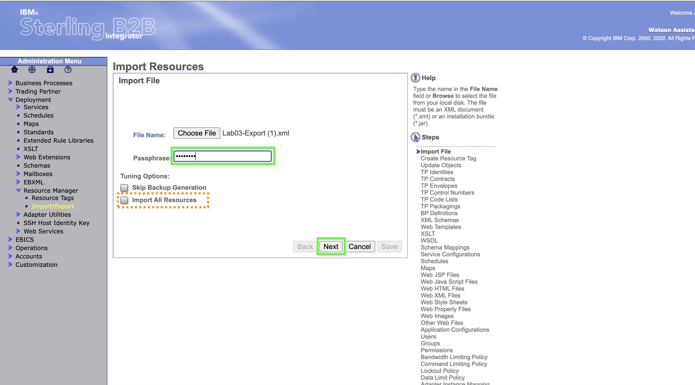

6. No changes to Resource Tags so click **Next** 

7. Leave the default to allow updates if objects already exist in the system.   Click **Next**

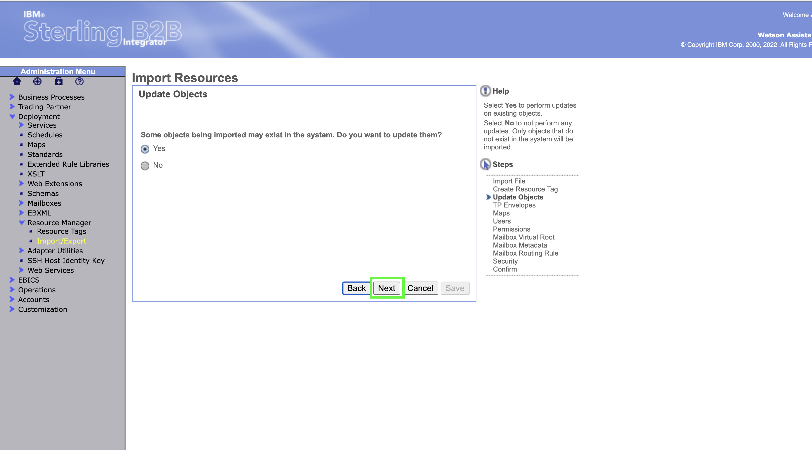

!!! hint
    Note sure what to hint about here....if anything.....

8. Use the **double down arrow** to select all of the TP (Trading Partner) Envelopes to be imported.  Note: There is actually no need to click on the individual resources being imported, if you use the double down arrow.  

9. The trading partner envelopes are shown as all selected. Click **Next** 

10. Use the **double down arrow** to select all of the Maps.  Then click **Next**

11. Use the **double down arrow** to select all of the Users.  Then click **Next**.  Note: The selected resources won't be shown moved into the "To Be Imported" box form this point in this documentation.

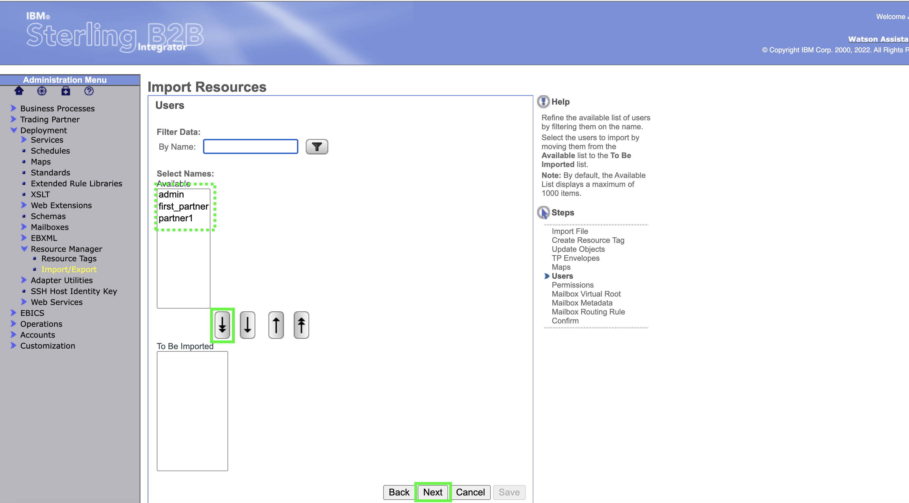

12. Use the **double down arrow** to select all of the Permissions.  Then click **Next**

13. Use the **double down arrow** to select all of the Mailbox Virtual Root.  Then click **Next**

14. Leave the default of **Select All**  Then click **Next**

15. Use the **double down arrow** to select all of the Mailbox Routing Rules.  
   
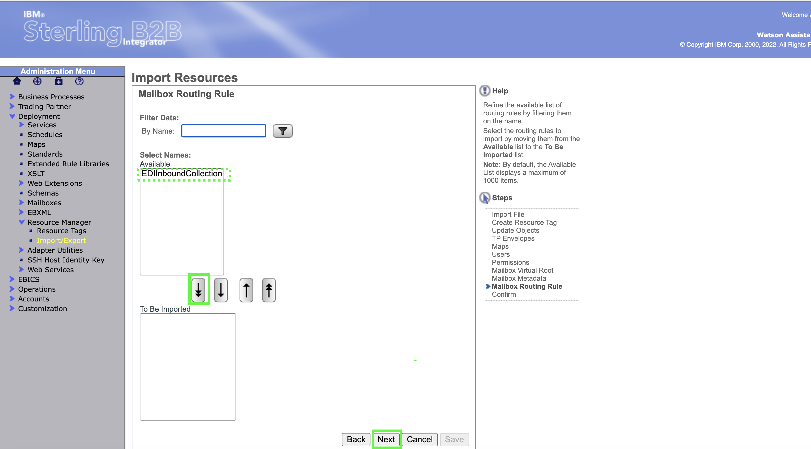

16.    All of the artifacts selected for import are shown on the Confirm panel.   If any are missing, hit the **Back** button and make the additional selections, otherwise, click **Finish**.  Note:  If "Import all Artifacts" was selected earlier, the configuration process will be the same from here in this documentation. 

17.    Click **Return** 

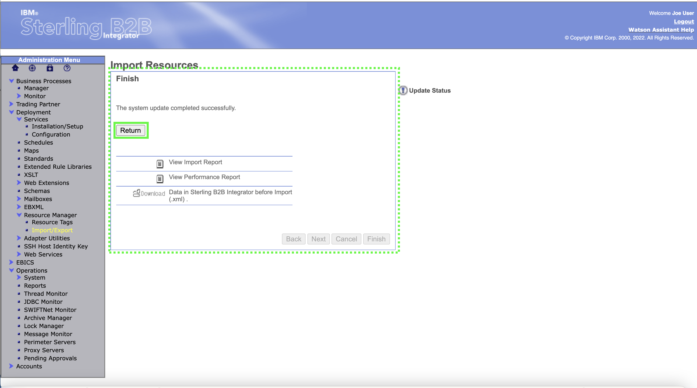

!!! important "Important"

    That is the end of the setup necessary for the lab.   In a customer demo situation, the above steps could  be executed ahead of time so that only the following steps are needed to show the demo scenario itself.

## Execute the Demo 3

!!! important "Important"
The demo instructions in the first lab in this course document how to setup Filezilla for a secure SFTP transfer into a B2B Integrator mailbox. If that lab has been completed, then the following additional steps are all that is required.  If that lab has not been completed, go back to do the Filezilla setup steps, then pickup here.  

The SFTP Protocol, the Host and Port are the same as what was set up in the first lab demo instructions.   For this lab ensure that the User is **partner1** and the Password is **password**.  Finally, click on **Connect**.   

??? question "BP quiz question"
    Not sure what question best here or even if the pop up is functioning.

1.  In the top panel on Filezilla, check that a connection was made.  If there is a problem with the connection, it can be from the partner name or password being incorrect, the Host URL and port being incorrect,  or the SFTP adapter in B2B Integrator not being enabled properly.   As stated above, the setup steps in lab 1 must have been completed for lab 3 to work properly.  In the lower right panel, the Lab03 directory must be available.  It was created on the import of resources above.   The B2B integrator File Adapter looks into that "lab03" directory and runs any time a new file is added to it.   

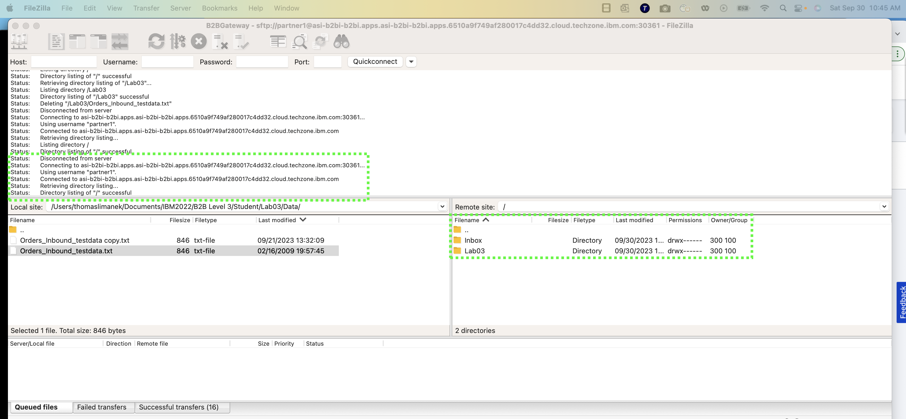

2.   Click the down arrow at the right of **Local Site** and navigate to where the sample input file is for this lab.   It is named "Orders_inbound_testdata.txt".  

The file name is not important but the specific contents are very important.  The initial process expects an EDI file, and then the translation maps will be expecting a specific usage of the EDIFACT ORDERS document for this partner.  The details of how B2B Integrator is setup to handle incoming EDI documents is fairly complex due to historical batching of many different partner, document type and even EDI standard that might be dropped into the "mailbox" / lab02 directory.  

3.   Before moving the file over to partner1's mailbox directory, **right click** on the file and choose to view it.   The top line of the file contains the sender and receiver identification, in this case 12345678:00 for the sender, and STERLINGSPORTS:00 for the receiver.  This "Envelope" structure is well known by EDI parsing software, so the receiver identifier is all that is needed to find the receiving party's preferred method of getting the data.   Close this view.  

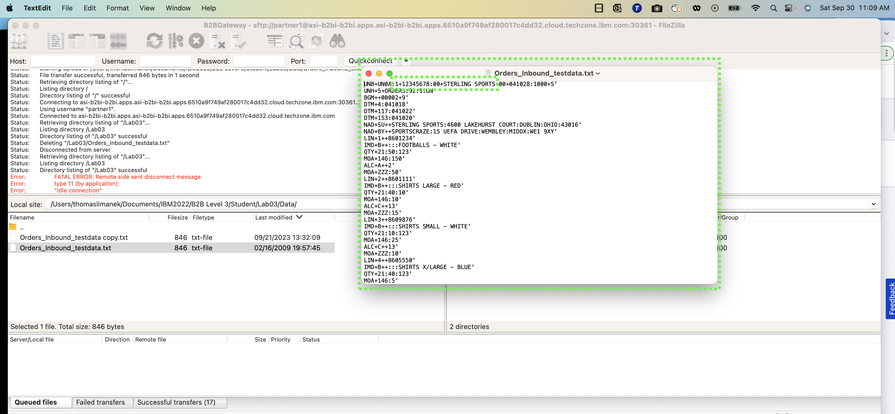

4.   Open the **lab03** directory in the remote site
   

5.   On the desktop itself choose the input file **outb810.txt** from the file system.  
 
!!! Note "Note"

    Generally, there may be something to note here later....placeholder kept.  

6.    Drag the input file over into the lab03 directory on the remote site

7.   The input file will be automatically picked up by the B2B Integrator process.  This specific process does not delete the file in the directory once it is processed.   In order to re-run the process, the file in lab03 directory on the remote site can be manually deleted via Fielzilla.   

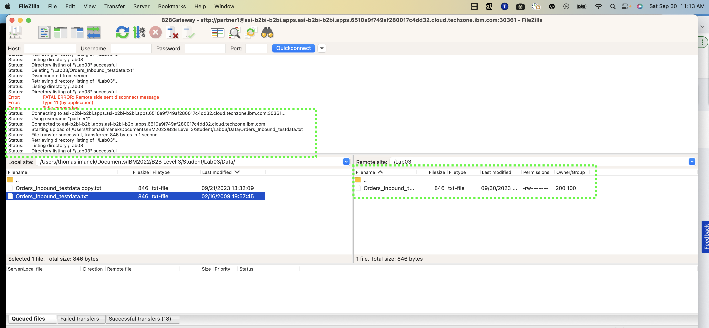

## View the Business Process Results

Now that the Business Process has run, the user can view detail of the process.  In B2B Integrator, the process takes several steps to determine the type of file / data standard being sent, the document type, the receiver, and then finally what translation map to run given the receiving partner and document type.  

1.   To follow the process, click **Current Processes** under **Monitor** which is under **Business Process**

2.  Three Business Processes will be run for this input process.   "EDIInboundBootstrap" determines the type of data standard for each transaction (in this case just one) in the input file.   B2Bi determines that this is an EDIFACT EDI transaction, and executes a specific process called "EDIFACTDeenvelopeUnified" on the transaction.   After deenveloping, the document type and receiving trading partner is known.  The translation occurs based on this information.   Click on the numeric **ID** field associated with the EDIInboundBootstrap.  
    
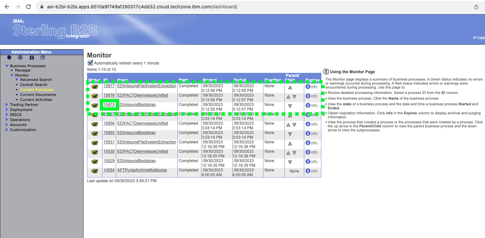

3.    Inside the Business Process Detail panel, click on **info** in the Document column to see the input file processed by B2B Integrator. 

4.   Metadata about the Primary Document is shown, along with the input interchange being processed.    Click the **red circle** or **CLOSE** to exit 

5.  Back on the Monitor page the Business Processes are shown again.         Click on the numeric **ID** field associated with the EDIInboundFileSystemExtraction.   

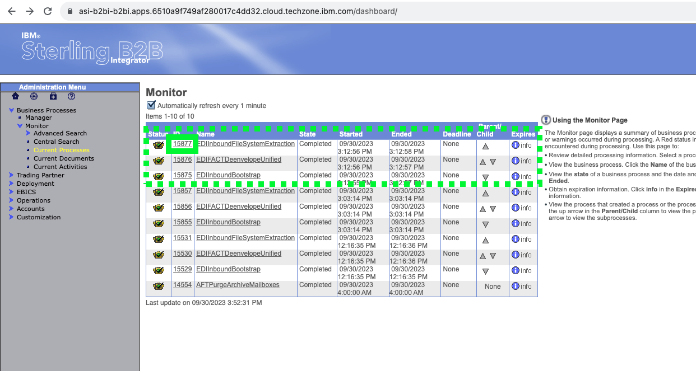

1.   To see the final output of the process, Click on **Info** in the last row under Document column.  
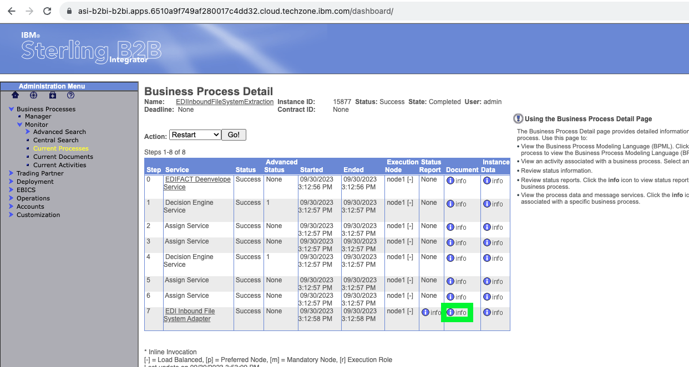

1.   The "application file" is shown.   This file contains the translated information from the iput EDI file, but in a format that is processable directly by a load program, for an Order Entry module of an ERP system.  Click on **CLOSE** to exit.   

??? question "BP quiz question"
    There is a quiz question somewhere around here....

This concludes lab03. 

