Demo 4 demonstrates a zipped file being sent into FileGateway, being unzipped, then the contents being routed to an appropriate mailbox for each file type.  

The import does not have to be part of the demonstration.   The business process, maps,  envelopes etc. are imported via B2B integrator, but since the process was created in Sterling FileGateway, the partners, community, routing channel templates, and routing channel are best viewed there.  

Before proceeding, take 3 minutes to listen to Thomas Limanek, B2B subject matter expert, explain the lab. 

 
## Import the FileGateway process

In the Demo 1 setup, the detailed steps inside Sterling FileGateway to create partners, community, routing channel template, and routing channel were shown.  In demos 2 and 3, the import process was shown in detail, where each of the separate artifact groups was selected.    In Demo 4, you will only be shown the fast version of doing the import for all resources.   You should have already downloaded the  <a href="https://raw.githubusercontent.com/IBM/SalesEnablement-SterlingDataExchange-V2-L3/main/tools/B2BiLevel3ImportsAndData.zip" target="_blank">B2BiDataAndImports.zip</a>. If not, refer to Demo 1 in the Optional Shortcut section for details.  

1. If you are not currently logged in to B2Bi, launch the IBM Sterling B2Bi dashboard by clicking on the route for the **sterling-fg-b2bi-asi-internal-route-dashboard** route in the **Location** column. Do not click the Route name, rather click the Route link in the **Location** column of the table.  

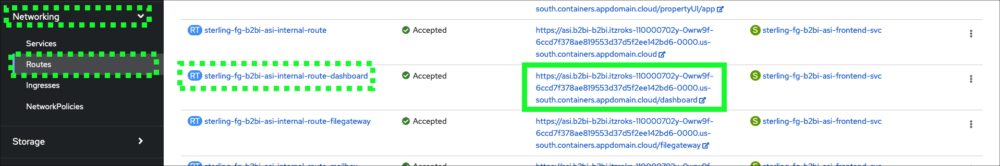
 
2. Once logged in, click through **Deployment**, **Resource Manager**, **Import/Export**
   
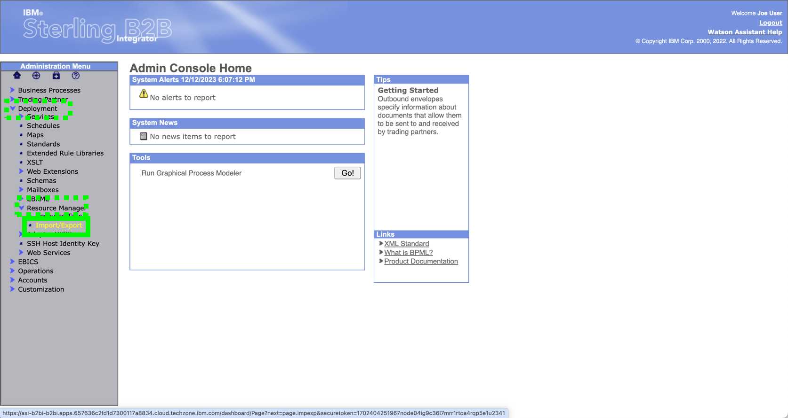
 
3. Select **Go** on the Import Resources panel
   
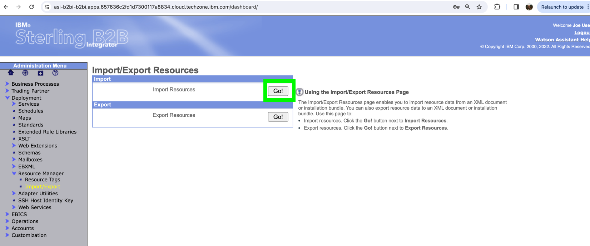

4. On the File Name line click on **Choose File** 
   
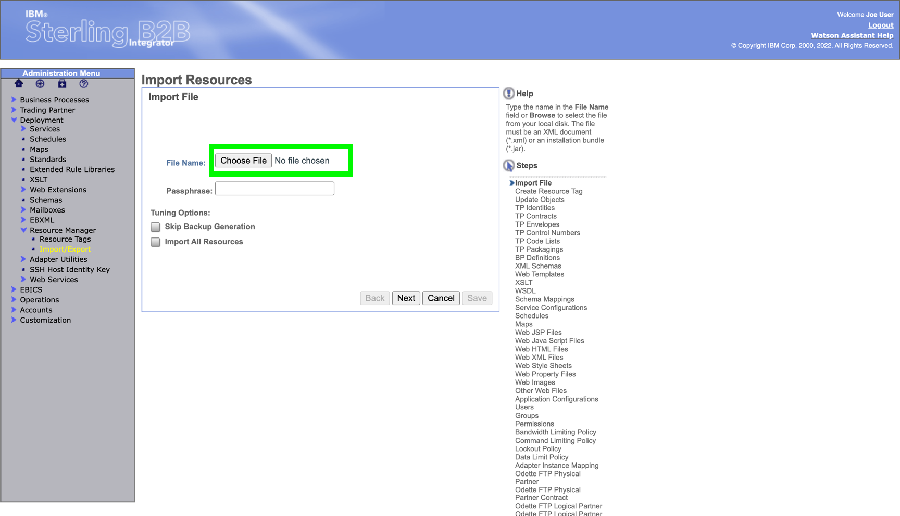

5. Open the Demo4 Directory on your desktop where the **B2BiLevel3ImportsAndData** zip file was expanded.  Under the **Import** folder Select file  **SFG-Lab4-Export.xml**   
   

6. See that the **SFG-Lab4-Export** Import file has been selected, enter **password** in the password box, and check **Import All Resources** then click **Next** 
   
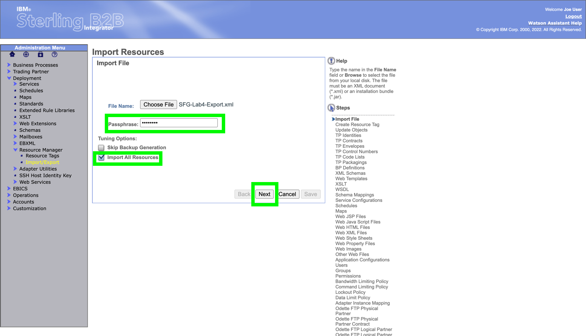 

7. Keep the ***Create Resource** defaults and click **Next**
   
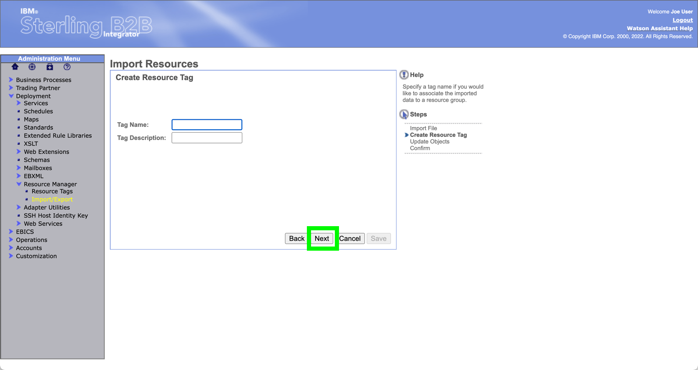 

8. Allow updates to any existing resources by leaving **Yes** selected and clicking **Next**
   
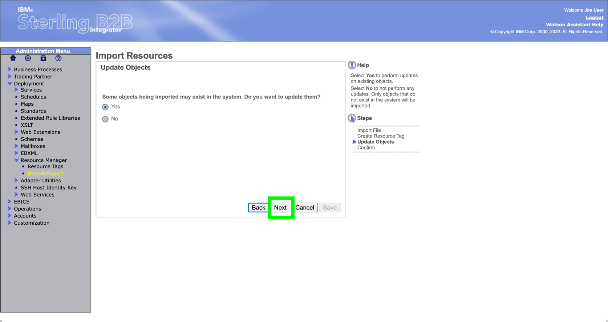 

1. All of the resources to be Imported are shown.   In this import the Community is **Demo_SFG_Community**, the partners are **DemoAgents** and **Demo_TransactionSystem**, the routing channel template is **Demo_UNZip** and the routing channel is defined with **Demo_Unzip:Demo_Agents::Demo_TransactionSystem:Demo_Agents/Zip** (The routing channel points to the Demo_Unzip routing channel template with producer Demo_Agents, consumer Demo_Tranaction_System, and initiating directoty of /Demo_Agents/Zip).    Click on **Finish** to complete the Import.  
   
??? question "BP quiz question"
    A BP quiz question will come from this review screen. Be sure to note the exact text on the Groups line.  

 

In the next section you will review the results of the Import process in a view mode.  You will logout of B2B Integrator and view the various pages in Sterling FileGateway. 

**Logout of B2B Integrator**

## View SFG configuration

Login to SFG

1. Return to the OpenShift web console and click on the route link to the IBM Sterling File Gateway user interface (UI): **sterling-fg-b2bi-asi-internal-route-filegateway**.

2. Enter **fg_sysadmin** in the User ID field, **password** in the Password field, and then click the **Sign In** button.

Once logged in to SFG follow these steps. 

3. Click the **Participants** pull-down menu item on top menu bar and **Partners** and see that **Demo_Agents** and **Demo_TransactionSystem** have been added.  Note: Other partners may or may not already exist depending on the order you execute the labs. 

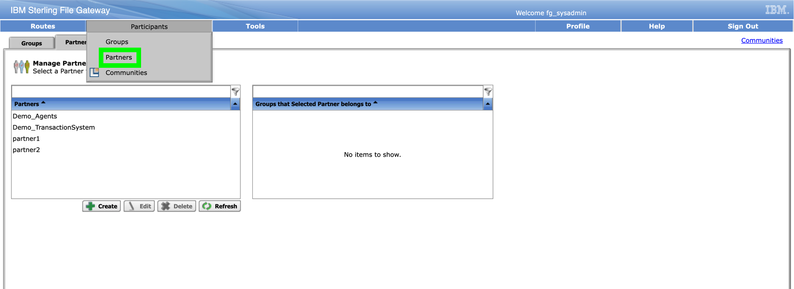

4. Click on partner **Demo_Agents** to see the detail.  Then click on **Return** to exit out. 

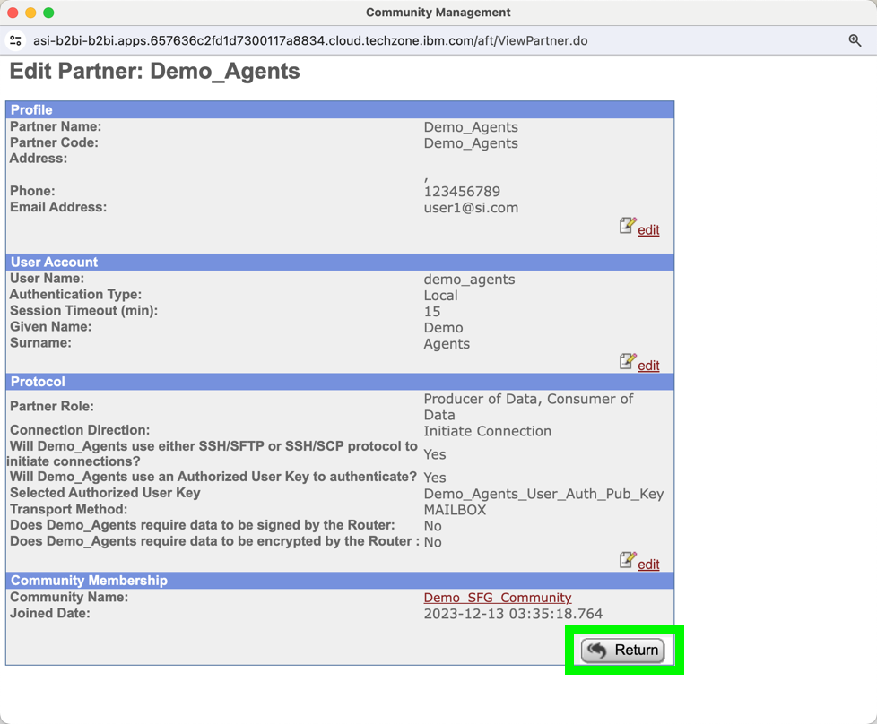

5. On the **Participants** pull-down click on **Communities**.

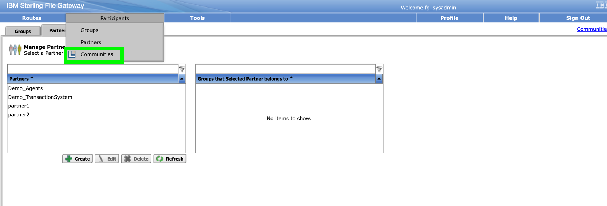

6. View that **Demo_SFG_Community** was created and then click on **edit** on that line to see details. 

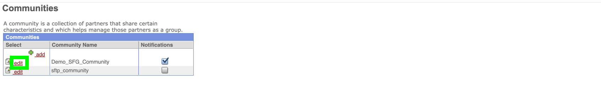

7. View the **Community Information** then click on **View** in the **Partner** section. 

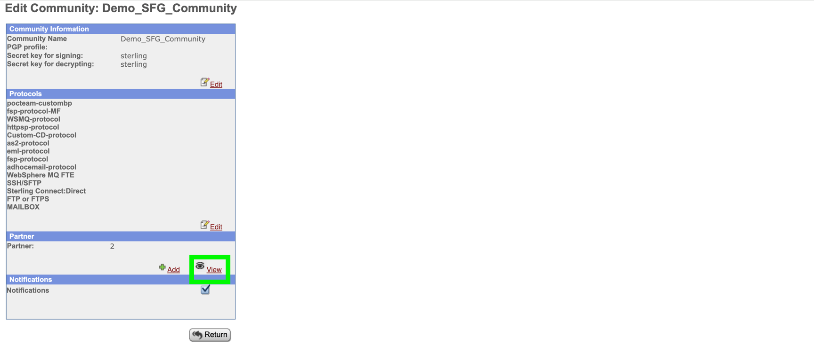

8. See that **Demo_Agents** and **Demo_TransactionSystem** are in the **Partner List** section.  Then click on **Return** to exit.   

9. View the Routing Channel Template setup by clicking **Routes** then **Templates**.   In here you can see how the zip file is expected via the regular expression from the producer, and how the various files are mailboxed after the unzipping.  

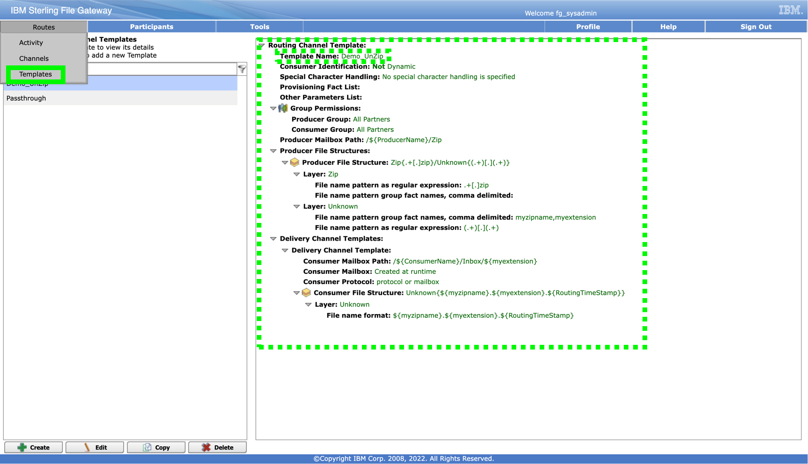

10.   Clicking **Routes** then **Channels** you can see that the **DemoUnzip** Routing Channel Template is used in the Routing Channel.  It has one direction, with **Demo_Agents** as the Producer and **Demo_TransactionSystem** as the consumer with **Demo_Agents/Zip** as the Producer Mailbox Path

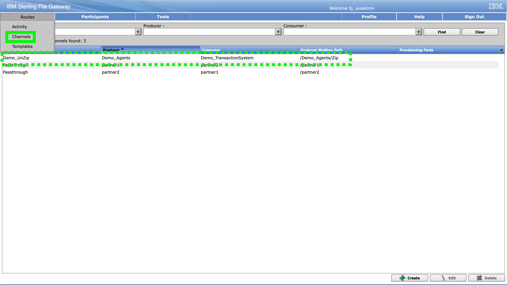

## Execute Demo 4

!!! important "Important"
    The instructions in Demo 1 of this course document how to setup Filezilla for a secure SFTP transfer into a B2B Integrator mailbox. Note that the host will change for each time that B2Bi / SFG is provisioned on Techzone, so be sure that the Host on Filezilla is adjusted accordingly. 

1. For this lab ensure that the User is **demo_agents** and the Password is **password**.  Finally, click on **Connect**.   

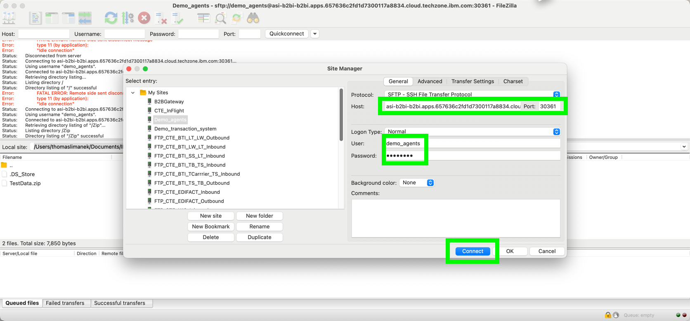

2.  In the top panel on Filezilla, check that a connection was made.  If there is a problem with the connection, it may be from the partner name or password being incorrect, the Host URL or port being incorrect, or the SFTP adapter in B2B Integrator not being enabled properly.   The SFTP Adapter setup steps in the B2Bi Base Configuration chapter of this training must have been completed for this lab to work properly.  In the lower right panel, the Zip directory must be available.  It was created on the import of resources above.   The B2B integrator File Adapter looks into that "Zip" directory and executes any time a new file is added to it.   

3.   Click the down arrow at the right of **Local Site** and navigate to where the sample input file is for this lab.   It is named "TestData.zip".  

The file name is not important but the specific contents are very important.  The initial process expects a zip file, and then business process will unzip the input and place it in the appropriate Consumer Mailboxes. 

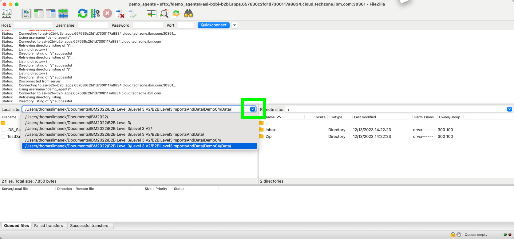

4.   1. Click open the **zip** directory in the remote site.   2. Drag the **TestData.zip** file into the opened zip directory.   3. The file will be deleted automatically after being pulled into the business process.  
   
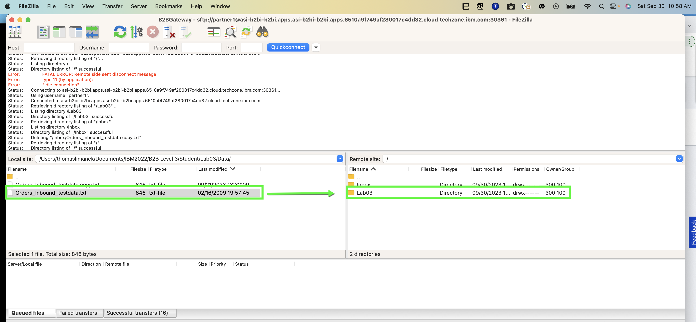

## View the Business Process Results

Now that the Business Process has run, the user can view detail of the process.  In B2B Integrator, the process takes several steps to determine the type of file / data standard being sent, the document type, the receiver, and then finally what translation map to run given the receiving partner and document type.  

1.   To follow the process, click **Current Processes** under **Monitor** which is under **Business Process**

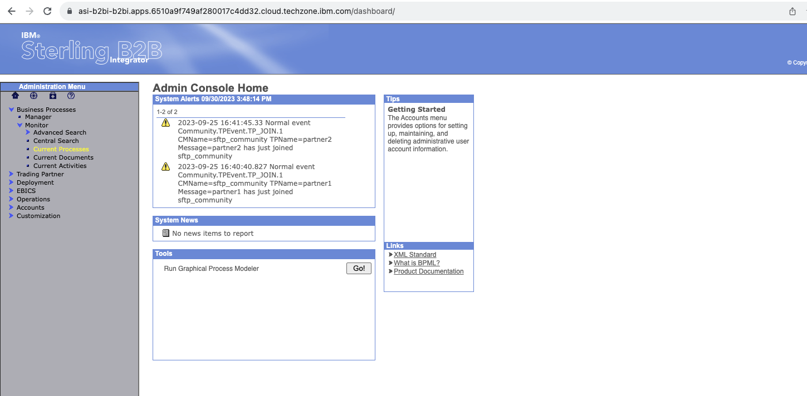

2.  Three Business Processes will be run for this input process.   "EDIInboundBootstrap" determines the type of data standard for each transaction (in this case just one) in the input file.   B2Bi determines that this is an EDIFACT EDI transaction, and executes a specific process called "EDIFACTDeenvelopeUnified" on the transaction.   After deenveloping, the document type and receiving trading partner is known.  The translation occurs based on this information.   Click on the numeric **ID** field associated with the EDIInboundBootstrap.  
    

3.    Inside the Business Process Detail panel, click on **info** in the Document column to see the input file processed by B2B Integrator. 

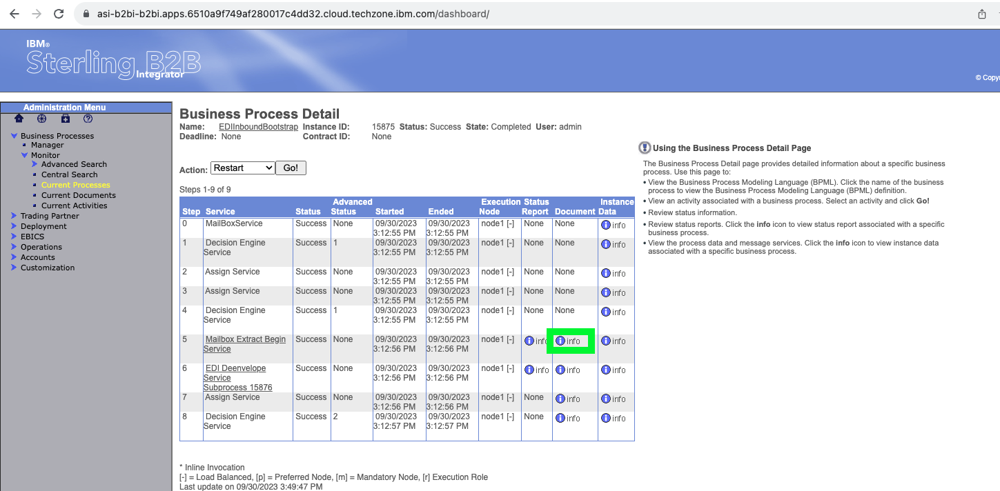

4.   Metadata about the Primary Document is shown, along with the input interchange being processed.    Click the **red circle** or **CLOSE** to exit 

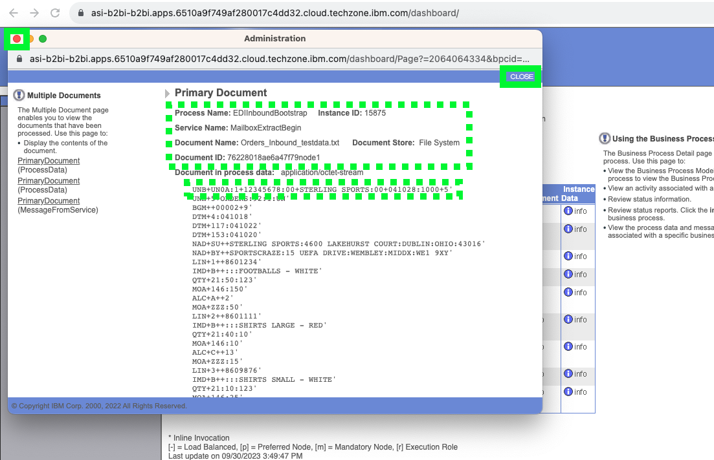

5.  Back on the Monitor page the Business Processes are shown again.         Click on the numeric **ID** field associated with the EDIInboundFileSystemExtraction.   

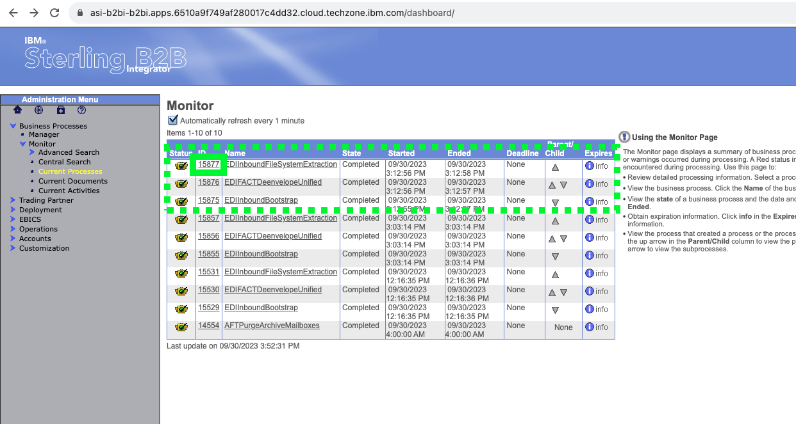

1.   To see the final output of the process, Click on **Info** in the last row under Document column.  
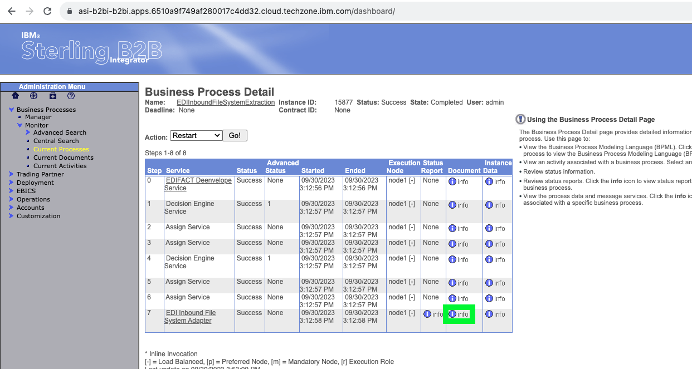

1.   The "application file" is shown.   This file contains the translated information from the iput EDI file, but in a format that is processable directly by a load program, for an Order Entry module of an ERP system.  Click on **CLOSE** to exit.   

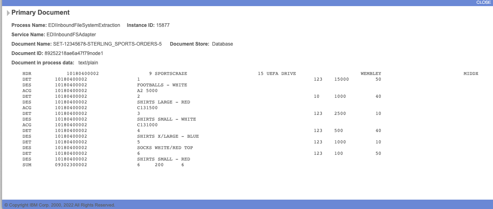

??? question "BP quiz question"
    There is a quiz question somewhere around here....

This concludes lab04. 

